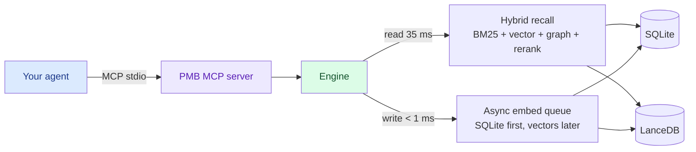

<div align="center">


# PMB

### Local-first memory for your AI coding agent.
### One file on your disk. Twenty-nine MCP tools. No cloud.

[](https://pypi.org/project/pmb-ai/)
[](LICENSE)
[](https://modelcontextprotocol.io)
[](#privacy)

[Install](#install) · [Demo](#what-it-feels-like) · [How it works](#how-it-works) · [FAQ](#faq)

</div>

---

PMB gives Claude Code, Cursor, Codex and the other MCP-aware agents a
real memory. Decisions you made last week. Lessons you taught them.
Personal facts about you. Project structure. PDFs. They survive every
restart, every model upgrade, every agent switch — because they live
in **one SQLite file on your disk**.

No API keys. No subscription. No LLM call on the read path. Just files.

```bash
pip install pmb-ai
pmb setup           # one prompt, detects your agent, wires it up
# restart your agent
```

That's it. Your agent now remembers.

---

## What it feels like

```
You:    fix that LoadGuard pricing bug we hit last Tuesday

Agent:  prepare(message="fix LoadGuard pricing bug")
        ↓ (6 ms)
        → project_context: 12 events about LoadGuard,
          4 lessons (incl. "never lower NEGOTIATE/SKIP under 25%"),
          3 decisions, 2 open goals
        → active_arcs: "LoadGuard verdict-policy refactor (started Tue)"
        → lessons: 1 directly matches "pricing"
        → recent_activity: 8 commits this week

        Looking at src/engine/verdict-policy.ts (you opened it Tuesday
        14:32, last changed Wednesday). The pricing bug you mentioned
        is on line 142 where the bundle fallback was tightening below
        the rate-floor. Per the lesson you saved, we should never
        drop the threshold under 25% — let me restore the guard there.
```

The agent didn't ask. It didn't guess. It read its memory in **6 ms**
and showed up to the task already informed.

---

## What you can put in there

```bash
# Personal facts that change                  (with time-travel: old
#                                                values archived, never lost)
record_keyed_fact("user", "city", "Warsaw")

# Project structure — symbols, imports, .gitignore-aware
pmb index project .

# PDFs (research papers, manuals, contracts)
pmb index pdf paper.pdf
pmb index pdf ~/docs --recurse

# Whatever your agent decides to log as it works
# (decisions, lessons, completed tasks, goals)
```

PMB is content-agnostic. If it's text the agent will care about later,
PMB will remember and retrieve it.

---

## What the agent gets back

A single MCP call — `prepare(message)` — returns the right things at
the right level of detail, in 4-16 ms:

| Field | What it is |
|---|---|
| `project_context` | Full project overview if the message mentions a project: key facts, lessons (RULES to follow), decisions, open goals, related entities, the project's narrative arc |
| `lessons` | Procedural rules matching the query, each with a `surface_id` so the agent can confirm it followed the rule later |
| `recent_activity` | Last 24 h of decisions / edits / completions for session continuity |
| `open_goals` | In-progress goals so the agent knows what you're pursuing |
| `active_arcs` | Narrative arcs the project is currently living in |

For everything else there's `recall(query)` (hybrid search, 35 ms warm)
and 27 other tools listed in [docs/COMMANDS.md](docs/COMMANDS.md).

---

## How it works



**Storage** — every event lives in SQLite. Vectors live in LanceDB next
to it. Both are files on your disk; copy them anywhere with `cp`.

**Recall** — BM25 (lexical) + dense vector (semantic) + entity graph
+ optional cross-encoder rerank, fused via Reciprocal-Rank-Fusion.

**Writes** — async. The MCP tool returns in under a millisecond. The
actual embed + LanceDB insert happens on a background thread.

**Dedup** — four layers. Exact text match → cosine ≥ 0.92 auto-merge
→ cosine 0.80-0.92 borderline (LLM verify later) → manual review in
the dashboard. Old values get archived, never deleted; full history
is queryable via `keyed_fact_as_of(t)`.

**Multilingual** — the default embedder is `bge-m3`, which natively
handles EN, RU, UA, plus 50+ more. A Russian query like *где я живу*
finds an English keyed-fact stored as *user.city = Warsaw* without
any translation.

---

## Install

```bash
pip install pmb-ai
```

Or from source:

```bash
git clone https://github.com/oleksiijko/pmb.git && cd pmb
python -m venv .venv && source .venv/bin/activate
pip install -e .
```

Prime the model once so the first `recall` is fast (the embedding model is
~90 MB; without this the very first query pays a one-time cold-start load):

```bash
pmb warmup
```

> **Running the tests?** Use the venv's Python, not your system Python —
> `.venv/bin/python -m pytest` (or `.venv\Scripts\python.exe -m pytest` on
> Windows). Running bare `pytest` outside the venv just reports missing
> `numpy`/`fastmcp`/`typer` — that's a missing venv, not a broken project.

Wire one or more agents:

```bash
pmb connect claude        # Claude Code
pmb connect codex         # OpenAI Codex CLI
pmb connect cursor        # Cursor
pmb connect windsurf gemini vscode zed opencode continue   # also supported
```

Point several agents at the same memory:

```bash
pmb connect claude --workspace personal
pmb connect cursor --workspace personal
# both now read/write the same workspace
```

Everything above is **stdio** — the server runs as a child process of your
agent. No network, no port, no token. That's the whole story for one person
on one machine.

> Sharing one memory across machines or a team? That's an optional HTTP
> mode with bearer-token auth — see [docs/TEAM.md](docs/TEAM.md). You don't
> need it for local use.

Inspect:

```bash
pmb dashboard     # http://127.0.0.1:8765
pmb tui           # terminal UI
pmb stats         # quick numbers
pmb doctor        # health check
```

---

## CLI cheat sheet

```bash
# Memory
pmb stats                                  show counts and storage info
pmb recall "query"                          search with full debug
pmb tui                                     interactive terminal UI
pmb dashboard                               web UI on port 8765

# Ingest
pmb index pdf paper.pdf                     extract + chunk + embed
pmb index pdf ~/docs --recurse              entire directory
pmb index project .                         scan codebase
pmb import chatgpt ~/Downloads/export.json  bring existing history

# Maintenance
pmb regraph                                 rebuild entity graph
pmb consolidate                             run sleep pass (optional)
pmb compact                                 archive old events
pmb dedupe                                  resolve borderline duplicates

# Hooks (force-feed PMB at the protocol level — no model cooperation)
pmb hooks install claude-code               wire all 4 lifecycle hooks
pmb hooks list                              show what's installed
pmb hooks capabilities                      ambient mechanism each agent supports
pmb hooks uninstall claude-code             remove them
pmb auto-context "fix bug in PMB"           preview per-turn injection
pmb session-restore -m 180                  preview post-compaction restore
pmb lesson-followcheck --dry-run            preview follow-through scoring

# Ambient memory (the write side — memory journals the agent's work)
pmb autowrite --dry-run                     preview ambient auto-write for this turn
pmb ambient-watch .                         ambient auto-write for MCP-only hosts (git observer)
pmb forget-auto                             drop memory the ambient layer wrote itself

# Config
pmb config list                             default tier (25 keys you care about)
pmb config list --pro                       every key, including 80 advanced knobs
pmb config set recall.ppr_enabled true      toggle a feature
pmb connect --rules-only                    refresh CLAUDE.md only
```

Full reference: [docs/COMMANDS.md](docs/COMMANDS.md).

## Settings — 25 you care about, 80 you don't

PMB has 105 tunables. The 25 that affect day-to-day quality are
**default-tier** — visible in `pmb config list`. The rest are
internal weights, ablation knobs, and experimental flags, hidden
behind `--pro` so the surface stays scannable.

Default-tier highlights:

| Key | Default | What it does |
|---|---|---|
| `recall.top_k` | 5 | How many results recall returns |
| `recall.bm25_weight` | 0.7 | BM25 vs vector mix (1.0 = pure BM25) |
| `recall.ppr_enabled` | **true** | Multi-hop graph diffusion, gated by intent |
| `recall.keyed_fact_boost` | 0.35 | How hard personal-attr facts win on personal queries |
| `recall.rerank` | false | Always-on cross-encoder (regresses LoCoMo, keep off) |
| `embedding.model` | `paraphrase-multilingual-MiniLM-L12-v2` | The vector model |
| `graph.extractor` | `regex` | `regex` / `spacy` / `llm:claude` / `llm:ollama` / `llm:codex` |
| `mcp.record_batch_async` | true | Fire-and-forget writes (sub-ms return) |
| `agent.active_mode` | false | Proactive logging in `pmb connect --active` |
| `agent.apply_lessons` | true | Agent surfaces lessons before acting |
| `agent.log_decisions` | true | Auto-log "we chose X over Y" |
| `agent.log_lessons` | true | Auto-log "we always/never do X" |
| `dedup.enable` | true | All four dedup layers |
| `decay.factor_per_day` | 0.985 | Importance half-life |
| `consolidate.auto_trigger` | false | Run the sleep-pass automatically |
| `chat.model` | `haiku` | Default model for `pmb-chat` |

Pro tier (`pmb config list --pro`) is where you go to tweak the
recall scoring weights (`recall.causation_boost`, `recall.arc_boost`,
`recall.ppr_alpha`), reranker internals (`recall.rerank_top_n`,
`recall.rerank_close_epsilon`), vocab mining
(`recall.auto_vocab_*`), dedup thresholds (`dedup.cosine_high`),
consolidate sleep heuristics, or experimental flags
(`recall.pamvr_enabled`, `recall.adaptive_decompose`,
`recall.typo_correction`).

Every pro-tier key still reads with `pmb config get <key>` and writes
with `pmb config set <key>` — they're hidden from `list`, not gated.

---

## Dashboard

`pmb dashboard` opens a local web UI on port 8765. Nothing leaves
your machine.

<div align="center">

</div>

Nine tabs: **Map** (entity graph, live), **Timeline** (git-graph by
project), **Overview**, **Entities**, **Arcs** (narrative threads),
**Lessons** (per-rule follow-rate, dead-lesson detection),
**Duplicates** (inline merge), **Performance** (per-tool latency),
**Recall** (debug ranker).

---

## Hooks — memory that doesn't wait to be asked

The hard part of agent memory isn't storing — it's getting the agent to
*use* what's stored. Soft instructions in a rules file get skipped. So
PMB wires four hooks at the protocol level (`pmb hooks install
claude-code`), and each removes a dependency on the model remembering to
act:

- **UserPromptSubmit → auto-recall.** Every message is classified (regex,
  multilingual, sub-ms) and the matching memory is fetched *for* the
  agent — lessons, past decisions, recall hits, project overview — and
  injected before the model thinks. The agent never has to decide to call
  `recall`. Trivial messages inject nothing.
- **PostToolUse → ambient observe.** Every tool the agent runs is appended
  to a lightweight action journal (`pmb track-action` — a single SQLite
  INSERT, no model, no vectors). Reads and `ls` are filtered out; edits,
  tests and commits are kept. This is the raw material the Stop hook turns
  into a memory if the agent never journals its own work.
- **SessionStart → session-restore.** When the context window compacts,
  the agent normally forgets what it just did. This hook rebuilds "where
  you left off" from what the session recorded — decisions, completed
  work, lessons, open goals — so it picks the thread back up instead of
  re-asking you.
- **Stop → follow-through + ambient auto-write.** At turn end PMB does two
  things. (a) *Follow-through:* it checks which surfaced lessons actually
  showed up in what the agent did (token overlap, gated on distinctive
  tokens) and marks them followed — *deterministically*, without the model
  self-reporting. (b) *Ambient auto-write:* if the agent did NOT call a
  `record_*` tool this turn, it synthesizes one activity entry from the
  observed actions, so real work is captured even when the agent stays
  silent. See **Ambient memory** below.

Preview any of them without an agent: `pmb auto-context "..."`,
`pmb session-restore -m 180`, `pmb lesson-followcheck --dry-run`,
`pmb autowrite --dry-run`.

---

## Ambient memory — the write side

Auto-recall fixed the *read* side: the agent no longer has to remember to
call `recall`. **Ambient memory** does the same for the *write* side —
the memory journals the agent's work even when it forgets `record_batch`:

- **Coordinated — never a duplicate.** If the agent already called a
  `record_*` tool this turn, ambient stays silent; the agent's own summary
  is richer. It only fills the gap.
- **Outcome-scored, not churn.** A turn is journaled only if it clears a
  quality bar driven by *results* — tests passed, a failure got fixed, a
  deploy/migrate ran, the breadth of edits — not by how many files were
  touched alone. Two mechanical edits and nothing else are dropped.
- **Honest + reversible.** Every ambient entry is tagged
  `source=autowrite`, shown as auto in the dashboard, and removable in one
  command (`pmb forget-auto`). **ON by default** — capturing work the
  agent forgot is PMB's signature; turn it off with
  `pmb config set autowrite.enabled false`.
- **Works on every host.** Claude Code via the PostToolUse + Stop hooks;
  OpenAI Codex by parsing its session rollout on `agent-turn-complete`
  (`pmb codex-notify`); MCP-only hosts (Cursor, Zed, VS Code) via a git
  observer that watches the working tree (`pmb ambient-watch .`). See what
  your agent supports with `pmb hooks capabilities`.

Synthesis is template-based by default (instant, deterministic, no model).
Opt into a nicer one-line summary from a local/CLI model with `pmb config
set autowrite.synthesizer llm:ollama` (or `llm:claude` / `llm:codex`) — it
has a timeout and falls back to the template, so it never blocks the turn.

---

## Self-improvement loop

Every lesson the agent surfaces carries a `surface_id`. Follow-through is
recorded two ways: the agent can confirm explicitly via
`mark_lesson_followed(surface_id, True)`, and the **Stop hook** infers it
automatically from recorded activity. The **Lessons tab** then shows, per
rule:

- How often it was shown to the agent
- How often it was followed (confirmed or auto-detected)
- `💀 DEAD` only when a rule is repeatedly **ignored** (✗ ≥ 2) — surfaced-
  but-unconfirmed is shown as `? UNVERIFIED`, never punished as dead
- `★ USEFUL` for rules followed ≥ 2×

You see which rules actually help and prune the ones that don't.

---

## Numbers

| | |
|---|---|
| Recall p50 / p95 warm | **35 ms / 110 ms** |
| `prepare(message)` warm | **4–16 ms** |
| `record_batch_async` | **&lt; 1 ms** |
| MCP cold boot | **3.7 s** |
| LoCoMo recall@10 (n=10) | **94.5 %** *(reproducible — see below)* |
| Multilingual mega-stress top-10 (900 q) | **99.2 %** |

Reproduce locally:

```bash
python scripts/benchmarks/benchmark_locomo.py --n-conversations 10
python scripts/benchmarks/mega_stress_test.py
```

---

## <a name="privacy"></a>Privacy

- 100 % offline by default. No network calls from the engine.
- Zero telemetry. There is no call-home to add later, because there is
  no PMB server to call.
- Workspace = directory under `~/.pmb/<name>/`. Copy it to Dropbox,
  push it to git, share it on a USB drive. Your call.
- Secrets are auto-redacted at write time (OpenAI / Anthropic / AWS /
  Stripe / GitHub keys; configurable).
- Apache 2.0 licensed. Forks welcome.

---

## FAQ

**Does PMB call an LLM?**
On read: never. On write: never by default. Optional: `pmb consolidate`
can run a local Ollama or Claude CLI pass over recent events to write
short reflections — opt-in, never required.

**What about cost?**
$0. There is no PMB service.

**Does the agent need to know about PMB?**
After `pmb connect`, the right rules are appended to `CLAUDE.md` /
`AGENTS.md` automatically. The agent learns the 29 default MCP tools (of
64 total — the rest are admin/sleep-mode ops, gated behind the `full`
tool profile) and the `prepare()` pattern from those rules.

**Will it slow my agent down?**
The MCP tools return in single-digit milliseconds for everything
except `recall` (35–110 ms warm), which is below human perception.

**Can two agents share one memory?**
Yes. Point them at the same workspace with `pmb connect <agent>
--workspace personal`. SQLite's WAL mode + a 10 s busy-timeout (set
automatically) handle the concurrent writes.

**What if I want to wipe a fact?**
`pmb forget <ulid>` archives it. Archives are excluded from recall
but survive on disk — you can always restore. Hard-delete is
`pmb forget <ulid> --hard`.

**Will this work on Windows?**
Yes. PMB is tested on Windows 11, macOS 14, and Ubuntu 22.04. Cyrillic
paths and console encoding are handled.

**What if I leave a project?**
`pmb workspace archive <name>` puts that memory on ice. `pmb workspace
restore <name>` brings it back six months later.

**Does it work with PDFs / code / Markdown?**
PDFs: `pmb index pdf paper.pdf`. Code: `pmb index project .`. Markdown:
`pmb import markdown ~/notes/`. ChatGPT / Claude exports:
`pmb import chatgpt path.json`.

**Cold start is slow.**
First recall after a fresh boot loads the embedding model (~3 s). Run
`pmb warmup` once or just let the prewarm thread on MCP server boot do
its job in the background.

**Roadmap?**
See [docs/ROADMAP.md](docs/ROADMAP.md). Highlights: hosted backup via
litestream, optional cloud-sync (BYO bucket), tree-sitter for Rust/TS
project indexing, image OCR.

---

## Contributing

Issues and PRs welcome. There's one full-time maintainer; please open
a discussion before a large change so we can align on direction.

```bash
git clone https://github.com/oleksiijko/pmb.git && cd pmb
python -m venv .venv && source .venv/bin/activate
pip install -e ".[dev]"
pytest                  # full suite, ~4 minutes
pytest -k recall        # fast subset, ~12 s
```

License: **Apache 2.0**.
