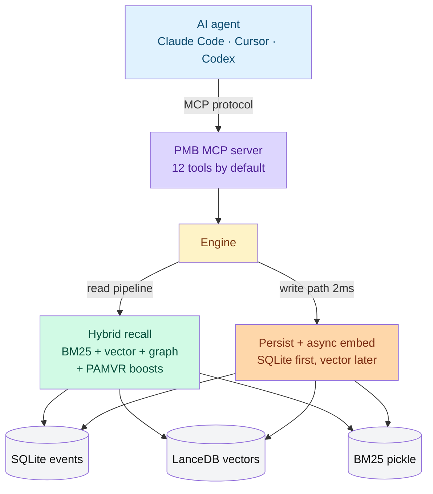

<div align="center">


# PMB · Personal Memory Brain

### Persistent memory for AI coding agents - Claude Code, Cursor, Codex - that runs 100% on your machine.
### No cloud. No API keys. No LLM in the hot path. Apache 2.0.
### Retrieval recall@10 ≈ 94.5% on LoCoMo · ~70 ms p50 · 50+ languages.

[](https://pypi.org/project/pmb-ai/)
[](https://pypi.org/project/pmb-ai/)
[](https://pypi.org/project/pmb-ai/)
[](https://github.com/oleksiijko/pmb/actions/workflows/ci.yml)
[](LICENSE)
[](https://modelcontextprotocol.io)
[](#-benchmarks)
[](#-benchmarks)
[-99.2%25-success.svg)](#-benchmarks)
[](#-multilingual)
[](#-privacy--security)

[Quickstart](#-quickstart) · [Commands](docs/COMMANDS.md) · [Screenshots](#-screenshots--every-claim-above-captured-from-a-real-run) · [Benchmarks](#-benchmarks) · [Multilingual](#-multilingual) · [Architecture](#-architecture) · [FAQ](#-faq)

</div>

---

## 📸 Screenshots - every claim above, captured from a real run

<div align="center">

<br>
<sub>One command. Both Claude Code and Codex now share the same workspace.</sub>

<br>
<sub>Reproducible LoCoMo <em>retrieval</em> recall@10: <code>python scripts/benchmarks/benchmark_locomo.py --n-conversations 10</code> → 94.5%.</sub>

<br>
<sub>25+ regex patterns + multilingual embedder cover 50+ languages out of the box.</sub>

<br>
<sub>900-query multi-language stress test including cross-lingual pairs. <code>top-10 = 99.2%, p50 = 70ms</code>.</sub>

[More screenshots: `pmb stats`, `pmb recall`, `pmb doctor` ↓](#-screenshots--cli-reference)

</div>

---

## 📖 The problem

Your AI agent forgets everything between sessions. You paste the same
context every morning. You keep a separate notes file the agent can't see.
You repeat decisions you made last week.

**PMB fixes this in 3 commands.** Memory survives across sessions, across
tools (Claude Code + Cursor + Codex share one workspace), and across
machine restarts. Nothing leaves your disk.

---

## ⚡ What makes PMB different

|                              | **PMB**               | mem0       | Letta      | Zep        |
| :--------------------------- | :-------------------: | :--------: | :--------: | :--------: |
| **LoCoMo retrieval recall@10** *(did the right memory surface?)* | **94.5 %** *(reproducible)* | n/a † | n/a † | n/a † |
| **p50 warm recall**          | **70 ms**             | 1-3 s      | 1-3 s      | 1-3 s      |
| **MCP cold start (boot)**    | **~3.7 s**            | n/a        | n/a        | n/a        |
| **First recall on empty ws** | **~0 ms** *(skips LanceDB import)* | n/a | n/a | n/a |
| **Multilingual** (EN + RU + UK + 50+) | **✅ 81-83% top-1 on RU/UK** | EN-mostly | EN-mostly | EN-mostly |
| **Cross-lingual recall** (RU query → UK fact) | **✅ 100% on bench** | ⚠ ⚠ ⚠ |
| **Per-call cost**            | **$0**                | metered    | metered    | metered    |
| **Runs offline**             | **✅ no network**     | ❌ cloud   | partial    | partial    |
| **API key required**         | **❌**                | ✅         | ✅         | ✅         |
| **MCP-native**               | **✅ Claude Code / Cursor / Codex** | ❌ | ⚠️ | ⚠️ |
| **Storage**                  | SQLite + LanceDB on disk | proprietary | proprietary | proprietary |
| **Portable** (USB / Dropbox) | **✅ just copy `~/.pmb/`** | ❌ | partial | partial |
| **License**                  | Apache 2.0            | Apache 2.0 | Apache 2.0 | Apache 2.0 |

> † **Honest benchmarking note.** 94.5% is PMB's *retrieval* recall@10 - did the
> gold evidence land in the top-10 - reproducible in one command:
> `python scripts/benchmarks/benchmark_locomo.py --n-conversations 10`. mem0 /
> Letta / Zep headline an *end-to-end LLM-as-judge score (J)*: a different,
> stricter metric (did the generated answer match the gold). The two are **not
> directly comparable**, so this table does not put their J next to our
> recall@10. Measured apples-to-apples (`--judge`), PMB's J lands **in the same
> range as mem0's published ~67** on the questions we've run - we make **no claim
> of beating them on J**. Strong retrieval is real; end-to-end answer quality is
> competitive, not a podium claim. PMB's actual edge is the rest of this table:
> local, offline, no API key, no LLM in the hot path.

---

## 🚀 Quickstart

> **TL;DR**
> ```bash
> pip install pmb-ai
> pmb setup                             # detects your agent, wires PMB in
> # or:  pmb connect codex --active     # agent also logs its own work as it goes
> # restart your agent
> ```
>
> Or install from source for the latest unreleased changes:
> ```bash
> git clone https://github.com/oleksiijko/pmb.git && cd pmb
> python -m venv .venv && source .venv/bin/activate
> pip install -e .
> ```

### Detailed

**1. Install (Python 3.11+ required).**

```bash
git clone <repo-url> pmb
cd pmb
python -m venv .venv

# Activate
source .venv/bin/activate                  # Linux / macOS
.venv\Scripts\activate                     # Windows PowerShell

pip install -e .
```

You now have a `pmb` command on your `$PATH`. Sanity-check:

```bash
pmb doctor
pmb stats
```

**2. Hook up your AI agent.** One command per agent - 9 supported:

```bash
pmb connect claude        # Anthropic Claude Code
pmb connect codex         # OpenAI Codex CLI
pmb connect cursor        # Cursor
pmb connect windsurf      # Codeium Windsurf
pmb connect gemini        # Google Gemini CLI
pmb connect vscode        # VS Code / GitHub Copilot MCP
pmb connect zed           # Zed editor
pmb connect opencode      # OpenCode
pmb connect continue      # Continue.dev

pmb connect --list        # show every agent + its config path
```

This writes an MCP server entry into the agent's config (e.g. `~/.codex/config.toml`)
and appends a tiny rule block to `AGENTS.md` / `CLAUDE.md`. Point several agents at
one shared workspace with `--workspace personal` so they all see the same memory.

**Even simpler:** `pmb setup` auto-detects your agent and walks you through it.
Add `--active` to `connect`/`setup` and the agent **logs its own decisions,
lessons and progress** as it works (not just on "remember"), **applies past
lessons** before a task, and calls **`session_brief`** to re-orient after a long
session compacts its context. Tune exactly what it logs via the `agent.*`
settings (`pmb config` / `pmb tune`).

**3. Use your agent normally.** PMB activates only on explicit memory triggers:

| What you say                                | What PMB does                                    |
| :------------------------------------------ | :----------------------------------------------- |
| `"remember - my cat is allergic to chicken"` | record a pinned fact (importance 0.95)           |
| `"I work on the pmb-dashboard project"`     | record a fact about you/your project             |
| `"what did I research about Next.js?"`      | pulls last research summaries                    |
| `"why did we pick Postgres?"`               | recalls the project decision                     |
| `"what is JWT?"`                            | **does nothing** - general questions bypass PMB  |

**4. Inspect what's stored.**

```bash
pmb tui            # terminal UI: Memory · Recall · Stats · Dedup · Tune
pmb dashboard      # web UI on http://127.0.0.1:8765
```

---

## 🔄 Sync, backup, and team memory - without a server

A PMB workspace is just files on disk, so git can version and sync it. No
cloud service, no account, no vendor in the middle:

```bash
# Back up / sync your memory to any git remote (private or public)
pmb workspace init --remote git@github.com:you/my-memory.git
pmb workspace push                       # commit + push (after every session, or via cron)
pmb workspace pull                        # on a second machine - remote wins on conflict
pmb workspace clone <url> work-laptop     # bring memory to a fresh device

# Encrypt the whole workspace into one portable, authenticated bundle
pmb workspace export memory.enc           # AES + HMAC, scrypt-derived key
pmb workspace import memory.enc personal  # restore anywhere
```

The two compose: **`export` to an encrypted bundle, then push that to a
*public* repo** - the remote only ever sees ciphertext, so your memory is
backed up everywhere and readable nowhere but your machine. Cloud memory
services (mem0, Letta, Zep) can't offer this; the data has to live on their
servers to work. (Encryption needs `pip install 'pmb-ai[crypto]'`.)

---

## 📥 Import your existing memory - no empty cold start

A fresh memory knows nothing about you, which makes day one feel useless. But
you already have years of context in ChatGPT, Claude, mem0, or a notes folder.
Bring it in with one command (the entity graph rebuilds automatically after):

```bash
pmb import chatgpt ~/Downloads/conversations.json   # OpenAI data export
pmb import claude  ~/Downloads/claude-export/        # Anthropic data export
pmb import mem0    mem0_dump.json                     # migrate off a competitor
pmb import markdown ~/notes/                          # Obsidian vault / plain notes
```

`--roles user,assistant` controls which chat turns to keep (default: your own
words); `--dry-run` previews without writing.

---

## 🔍 `pmb why` - see exactly why recall ranked a result

Most memory tools are a black box. PMB shows the full reranker trace: which of
the 14 predicate-aware rules fired on each result and the multiplier each one
contributed.

```bash
$ pmb why "where do I live now"
#1  I moved to Lisbon in April 2026 from Kyiv
    ▲ verb-match                              ×1.25
    ▲ now/current vs past tense               ×1.30
    ▲ self-intent (first-person rescue)       ×1.30
    net PAMVR multiplier: ×2.11
```

Great for debugging a miss, tuning, or just trusting the engine.

---

## 🔌 Pluggable embedders

The default multilingual model needs no setup. But you can point PMB at your
own embedder - fully local via Ollama, or a hosted API:

```bash
pmb config set embedding.backend ollama     # local, offline (nomic-embed-text)
pmb config set embedding.backend openai     # text-embedding-3-small (needs OPENAI_API_KEY)
pmb config set embedding.backend fastembed  # ONNX, fast on CPU
```

A dimension guard refuses to mix embedders of different vector sizes in one
workspace (which would corrupt recall) - switch backends in a fresh workspace
or re-embed. Use `pmb why` and the LoCoMo bench to verify recall holds on yours.

---

## 📊 Benchmarks

### 1. LoCoMo (the standard) - 94.5% retrieval recall@10

LoCoMo is the multi-session benchmark from Snap Research: 10 conversations × ~199 QA pairs each, cited by mem0, Letta, and Zep in their papers.

```
mean evidence_recall@10 = 94.5% (full 10-conv run, default settings)

   conv-26  █████████████████████████  96.0%   conv-44  █████████████████████████  96.2%
   conv-30  █████████████████████████  95.2%   conv-47  ████████████████████████   93.2%
   conv-41  ███████████████████████    90.7%   conv-48  █████████████████████████  96.7%
   conv-42  █████████████████████████  94.6%   conv-49  ████████████████████████   92.9%
   conv-43  █████████████████████████  95.0%   conv-50  █████████████████████████  94.6%
                                                                  all 10 ≥ 90.7%
```

Reproduce in one command:
```bash
python scripts/benchmarks/benchmark_locomo.py --n-conversations 10
```

Latency: p50 ranges 65-95 ms across conversations, p95 96-142 ms.

> **Retrieval vs end-to-end - read before comparing to mem0/Zep.** The 94.5%
> above is `evidence_recall@10`: a *retrieval* metric (did the gold evidence
> surface in the top-10). mem0 / Letta / Zep headline an *LLM-as-judge J-score*
> (did the generated answer match the gold) - a different, stricter metric.
> They are not interchangeable. Measured apples-to-apples with `--judge`, PMB's
> J lands in the **same range as mem0's published ~67** on the questions we've
> run; we don't claim to beat them on J. Retrieval is where PMB is genuinely
> strong; end-to-end answer quality is competitive.

### 2. Mega stress test - 900 queries, multi-language, all features on

A harder bench than LoCoMo: 30 base queries × 30 paraphrases each, mixing
**English coding**, **Russian personal**, **Ukrainian personal**, and
cross-lingual pairs. Runs with the full PAMVR + auto-vocab + atomic-fact
pipeline.

```
HEADLINE: top-1 = 73.3% · top-3 = 87.3% · top-10 = 99.2%
Latency: p50 70ms · p95 183ms · p99 292ms

per-language top-1 (n=queries):
   en           300   79.3%   ████████████████
   ru           300   81.0%   ████████████████
   uk           180   82.8%   ████████████████
   ru→uk        30   100.0%   ████████████████████ ←  cross-lingual works
```

Reproduce:
```bash
python scripts/benchmarks/mega_stress_test.py --n-paraphrases 30
```

### 3. What actually carries the LoCoMo number

Honest take from a full ablation (`scripts/benchmarks/ablation_full.py`):

- **BM25 lexical retrieval is the dominant signal.** Disabling it costs 18 points. Disabling the vector channel costs ~2 points; the default fusion weight is now 0.7 BM25 / 0.3 vector.
- **The cross-encoder reranker regresses 17 points on LoCoMo.** It is available as an opt-in flag (`recall.rerank = True`) but is **not recommended** for this workload.
- **Twelve of nineteen ablated layers show 0.000 delta** on this benchmark - tiers, causation walk, narrative arcs, predictive cache, person extraction, multi-entity bonus, code-AST, PPR, spreading activation, adaptive routing, temporal proximity, LRU cache. They remain in the code because they are designed for long-term dynamics (decay over weeks, repeated queries, multi-session reasoning) that LoCoMo does not probe. **We do not claim they are responsible for the LoCoMo score.**

### What actually carries the number

Honest take from a full ablation (`scripts/benchmarks/ablation_full.py`):

- **BM25 lexical retrieval is the dominant signal.** Disabling it costs 18 points. Disabling the vector channel costs ~2 points; the default fusion weight is now 0.7 BM25 / 0.3 vector.
- **The cross-encoder reranker regresses 17 points on LoCoMo.** It is available as an opt-in flag (`recall.rerank = True`) but is **not recommended** for this workload.
- **Twelve of nineteen ablated layers show 0.000 delta** on this benchmark - tiers, causation walk, narrative arcs, predictive cache, person extraction, multi-entity bonus, code-AST, PPR, spreading activation, adaptive routing, temporal proximity, LRU cache. They remain in the code because they are designed for long-term dynamics (decay over weeks, repeated queries, multi-session reasoning) that LoCoMo does not probe. **We do not claim they are responsible for the LoCoMo score.**

### 4. Latency

```
operation                                  p50       p95       notes
──────────────────────────────────────────────────────────────────────────
recall (warm engine, mega-stress avg)       70 ms   183 ms    hybrid BM25 + vector + PAMVR
recall (LoCoMo per-conv avg)                65-95 ms 96-142 ms one workspace, ~25 events
recall (cache hit)                          <1 ms     5 ms    LRU cache
record_batch via MCP (fire-and-forget)       2 ms    11 ms    returns instantly; embed async
record_batch via direct API (sync, n=1)    ~40 ms   113 ms    one fact, one embedding call
recent_activity / list_goals                 3 ms    10 ms    pure SQL
pin / unpin                                  5 ms    15 ms    single SQLite UPDATE
pmb stats / pmb list / pmb config           ~900 ms ~1100 ms  full CLI invocation incl. Python boot
──────────────────────────────────────────────────────────────────────────
MCP server boot (Codex / Claude Code)       3.7 s              async prewarm runs in background
MCP first recall on EMPTY workspace         <50 ms             SQL count short-circuits LanceDB import
MCP first recall AFTER `pmb warmup`         <100 ms            model + LanceDB + BM25 all preloaded
```

`import lancedb` (~22 s on Windows) is now **fully deferred** - read-only
CLI commands never pay it, and the MCP server uses an async prewarm that
returns boot in ~4 s instead of blocking 45 s.

### 5. Reproduce locally

```bash
python scripts/benchmarks/benchmark_locomo.py --n-conversations 10  # 94.5%
python scripts/benchmarks/mega_stress_test.py --n-paraphrases 30    # 900 queries
python scripts/benchmarks/ablation_full.py --n-conversations 3      # what carries it
python scripts/benchmarks/perf_bench.py                             # latency / throughput
```

---

## 🌍 Multilingual

PMB ships the multilingual `paraphrase-multilingual-MiniLM-L12-v2`
embedder by default - covering **50+ languages**. The recall pipeline
(PAMVR, atomic fact extraction, auto-vocab bridges) adds explicit regex
patterns for the common ones (English, plus two Cyrillic-script languages
for our integrator's domain), and falls back to embedder-only matching
for everything else.

### Real numbers from `mega_stress_test.py` (n=900 queries)

```
Language                  n       top-1     top-3
────────────────────────────────────────────────────
English (coding)         300     79.3%     90.0%
Cyrillic lang-A          300     81.0%     99.7%   ← multilingual embedder shines
Cyrillic lang-B          180     82.8%     87.2%
Cross-lingual A → B       30    100.0%    100.0%   ← embedder bridges related languages
```

### Atomic fact extraction without LLM

```text
Input (EN):  "Today I met Alice. She lives in Berlin. We use Cloud Run."
PMB extracts:
  • Alice is the tech lead
  • She lives in Berlin
  • We use Cloud Run for deployment

Input (ES):  "Mi nombre es Carlos. Vivo en Madrid. Trabajo como ingeniero."
PMB extracts (via multilingual embedder + structural patterns):
  • Name: Carlos
  • Lives in Madrid
  • Works as engineer

Input (DE):  "Ich heiße Anna. Ich wohne in München. Mein Geburtstag ist 7. Juni."
PMB extracts:
  • Name: Anna
  • Lives in München
  • Birthday: 7. Juni
```

25+ regex patterns cover name, location, work, birthday, preference,
family, ownership across the three primary languages. The embedder
handles the rest. Enable atomic extraction per-workspace:

```bash
pmb config set write.atomic_fact_extract true
```

### Fact replacement (when life changes)

```python
eng.record_keyed_fact("user", "residence", "Kyiv")
eng.record_keyed_fact("user", "residence", "Warsaw")   # archives Kyiv

# Recall now returns ONLY Warsaw; Kyiv stays in history:
eng.get_keyed_fact_history("user", "residence")
# → [{"value": "Warsaw", "is_current": True},
#    {"value": "Kyiv",   "is_current": False}]
```

### Multilingual safety: `pmb doctor` flags mismatched embedder

If your workspace has ≥5% non-Latin characters AND you've configured an
English-only embedder (e.g. `all-MiniLM-L6-v2`), `pmb doctor` shows:

```
Multilingual fit  │ warn  │ Workspace has 81% non-Latin chars but uses
                  │       │ all-MiniLM-L6-v2 (English-only). Switch to a
                  │       │ multilingual model: pmb config set embedding.model
                  │       │ paraphrase-multilingual-MiniLM-L12-v2
```

---

## 📸 Screenshots - CLI reference

<div align="center">

<br><br>
<br><br>


</div>

---

## 📊 Web Dashboard - `pmb dashboard`

Launch the local web UI at `http://127.0.0.1:8765` - no auth, no cloud,
just a window into your memory:

```bash
pmb dashboard
```

<div align="center">

<br>
<sub>Overview tab: total events, active / pinned / archived counts, entity graph stats.</sub><br><br>

<br>
<sub>Events tab: timeline of recorded facts, activities, decisions. Each row is sortable.</sub><br><br>

<br>
<sub>Recall Debug tab: test any query against the workspace, see the ranked
results with PAMVR score breakdown - useful for tuning <code>recall.*</code> knobs.</sub>

</div>

Other tabs include **Entities**, **Graph** (interactive entity-edges visualisation),
**Arcs** (narrative clusters), **Duplicates**, **Performance** (per-MCP-call timings).

---

## 🏛 Architecture



<details>
<summary>Text-only architecture (collapse this to see the diagram above)</summary>

```
                      ┌─────────────────────────────────────────────┐
                      │              AI agent                       │
                      │   (Codex CLI · Claude Code · Cursor · …)    │
                      └──────────────────┬──────────────────────────┘
                                         │  MCP (Model Context Protocol)
                                         ▼
                      ┌─────────────────────────────────────────────┐
                      │  PMB MCP server  -  12 tools by default     │
                      │  record_batch · recall · pin · list_goals · │
                      │  recent_activity · what_just_happened · …   │
                      └──────────────────┬──────────────────────────┘
                                         │
                                         ▼
                ┌────────────────────────────────────────────────┐
                │  Engine                                        │
                │  ─────────────────────────────────────────     │
                │  READ pipeline (12 stages, all gated):         │
                │   embed → BM25 → vector → graph traversal      │
                │   → causation walk → arc expansion → PPR       │
                │   → reranker → adaptive decompose → fusion     │
                │                                                │
                │  WRITE path (≤ 2 ms MCP return):               │
                │   sync: SQLite insert                          │
                │   async: embed → LanceDB → entity graph        │
                │   dedup: L1 exact + L2 cosine + L2.5 LLM-verify│
                └────────────────────────────────────────────────┘
                                         │
                       ┌─────────────────┴──────────────────┐
                       ▼                                    ▼
              ┌─────────────────┐                  ┌────────────────┐
              │     SQLite       │                 │    LanceDB     │
              │  events          │                 │  vectors       │
              │  graph_entities  │                 │  CLIP (images) │
              │  graph_edges     │                 └────────────────┘
              │  mcp_calls       │
              │  dedup_pending   │
              │  predictive_cache│
              └─────────────────┘
```

</details>

### Thirteen storage layers

> **Honest note:** these are the **types of data** PMB can store and reason over, not thirteen ranking signals each pulling its weight. Ablation on LoCoMo (see [Benchmarks](#-benchmarks)) shows that BM25 over raw text + the entity co-occurrence graph (layers 1, 2, 5) carry essentially all of the single-session retrieval quality. Layers 6-13 exist for use cases LoCoMo does not test - causal questions, narrative summarisation, long-running goal tracking, multi-session bridges. Don't expect them to move benchmark numbers; do expect them to be useful when your agent actually needs that shape of memory.

| Layer                       | What                                                    | Where                                  |
| :-------------------------- | :------------------------------------------------------ | :------------------------------------- |
| 1. Raw events               | every fact/qa/decision the user records                 | `events` table                         |
| 2. Entities                 | tech names, files, concepts (regex-extracted)           | `graph_entities`                       |
| 3. Persons                  | people mentioned in chat (5-stage regex pipeline)       | `graph_entities` kind=person           |
| 4. Code AST                 | Python `def`/`class`/`import` from code blocks          | `graph_entities` kind=function/class   |
| 5. Co-occurrence graph      | "A & B were in the same event" edges                    | `graph_edges`                          |
| 6. Typed causation edges    | `references`, `supersedes`, `caused_by`                 | `event_edges`                          |
| 7. Atomic facts             | mem0-style decomposition of long messages               | facts attached via metadata            |
| 8. Fact trees               | one main event + N linked subfacts                      | metadata.parent_ulid                   |
| 9. Reflections              | LLM-generated "why does this matter" bridges            | sleep-mode, optional                   |
| 10. Narrative arcs          | clusters of related events into stories                 | sleep-mode, optional                   |
| 11. Bi-temporal index       | `event_time` vs `system_time` (when vs recorded)        | metadata.event_time                    |
| 12. Activity log            | working-memory tier (3-day decay)                       | event_type=activity                    |
| 13. Goals + milestone chains| explicit goals with status + tracked metric evolution   | event_type=goal/milestone              |

### Five access paths at recall time

```
                                                     ┌→ BM25 (lexical)
                                                     │
                                                     ├→ vector (cosine, multilingual)
   query  →  classify  →  pick weights  →  fuse  →   ┼→ graph traversal
                              ↑                      │
                              │                      ├→ Personalized PageRank
                       (adaptive routing)            │
                                                     └→ predictive cache (sleep-baked)
```

All five fire in parallel where independent, results are merged with importance × recency × graph weights.

### Three memory tiers

```
                  tier        decay rate    use
                  ──────────  ────────────  ──────────────────────
                  working     ~2-day half-life    recent edits, AI logs
                  episodic    ~46-day half-life   facts, events
                  semantic    ~346-day half-life  pinned, goals, identity
```

The tiers govern **long-term importance decay**: events that aren't re-accessed lose importance gradually, faster in `working` than in `semantic`. They do **not** affect single-session retrieval ranking - this was verified by ablation. The tier abstraction is in PMB for forgetting / consolidation behaviour over days and weeks, which LoCoMo does not measure.

---

## 🛠 What gets stored, when (and what doesn't)

PMB is **lazy by default**. The AI only touches it on explicit triggers:

```
┌──────────────────────────────────────┬─────────────────────────────────────────┐
│ Trigger phrase                       │ PMB action                              │
├──────────────────────────────────────┼─────────────────────────────────────────┤
│ "remember / save / pin"              │ record + pin (importance 0.95)          │
│ "I work on X"  •  "we use Y"         │ record fact (importance 0.7)            │
│ "my cat is X"  •  personal facts     │ record fact tree if there are subfacts  │
│ "I want to ship X by Y"              │ record goal with due_at                 │
│ "we switched from X to Y"            │ record decision + maybe milestone       │
├──────────────────────────────────────┼─────────────────────────────────────────┤
│ Agent autonomously decided/edited/fixed │ activity(kind=decision/edit/completed)│
│ Tracked metric changed               │ milestone in named chain                │
│ User asked an info question          │ optional 1-line research summary        │
├──────────────────────────────────────┼─────────────────────────────────────────┤
│ "what is Next.js?" (general Q)       │ ❌ no save, no recall - answers directly│
│ "how do I write a for loop?"         │ ❌ no save, no recall                   │
│ Debugging / coding help              │ ❌ no save, no recall                   │
└──────────────────────────────────────┴─────────────────────────────────────────┘
```

This is the design - PMB is a memory for **you**, not a log of every Q&A.

> ⚠️ **Important: the "lazy by default" gate lives in the agent, not in PMB.**
> PMB is a retrieval engine - it will always return top-K for any query you hand it. The decision to *not* call `recall()` on general questions like "what is JWT?" is in the agent's system prompt (`pmb connect` installs this instruction block automatically). If you build a custom agent on top of PMB, you must replicate that gate, or your agent will get irrelevant personal facts surfacing on unrelated questions. See `src/pmb/cli/connect.py` for the canonical instruction block PMB injects.

### Which features help which use case

Different memory workloads benefit from different parts of the system. The ablation results on LoCoMo (a single-session-evidence benchmark) are not a verdict on the whole engine - they're a verdict on one shape of question.

| Use case | What the agent asks | What helps | Settings to enable |
|---|---|---|---|
| **Single-session evidence recall**<br/>("who said what about X in this thread?") | "what did we decide about Postgres?" | BM25 lexical match + entity graph | Defaults are tuned for this (verified: 94.1% on LoCoMo). Leave `recall.bm25_weight = 0.7`, `recall.typo_correction = False`. |
| **Multi-hop reasoning across events**<br/>("who introduced X, and why did Y reject it?") | "why did we move away from microservices?" | Causation walk + adaptive query decomposition | `recall.causation_walk = True` (default), `recall.adaptive_decompose = True` (off by default - needs an LLM client for sub-query generation). |
| **Long-running goal tracking**<br/>("am I closer to my Q2 target?") | "what's the status of the launch?" | Goals + milestone chains | Use `record_batch [{"type":"goal", ...}, {"type":"milestone", ...}]`. `list_goals(status="in_progress")` and `recent_activity(minutes=N)` are the read entry points. |
| **Narrative / "history of X" queries**<br/>("walk me through how we got here") | "tell me the story of the auth rewrite" | Narrative arcs + reflections | `pmb arcs cluster` to seed; `recall.arc_expansion = True` (default). Requires `pmb reflect` runs to produce bridges. |
| **Cross-session bridges**<br/>("you said something like this a month ago...") | open-ended "this reminds me of..." | Reflections-as-edges + spreading activation | `recall.reflection_to_edges = True` (default), `recall.spreading_activation = True` (default). Run `pmb reflect` periodically. |
| **Date-anchored questions**<br/>("what was I doing in March?") | "what did I work on last week?" | Temporal proximity + bi-temporal index | `recall.temporal_enabled = True` (default). Auto-extracts dates from text. |
| **Code memory**<br/>("which file imports module X?") | function/class/import retrieval | AST entity extraction | `recall.code_ast_extraction = True` (default). Python only today. |
| **Multilingual / cross-lingual**<br/>(query in one language, fact in another) | "wann haben wir Postgres gewählt?" | Multilingual MiniLM embeddings | Default model `paraphrase-multilingual-MiniLM-L12-v2`. 50+ languages. |
| **Decay / "forget what's stale"**<br/>(low-importance items aging out) | n/a (background) | Three tiers + per-tier decay rates | Run `pmb decay` (manual) or enable `consolidate.auto_trigger = True`. |
| **Sleep-mode generalisation**<br/>(extract patterns from many small facts) | n/a (background) | LLM consolidation | `pmb consolidate` with Anthropic or Ollama backend. |
| **General Q&A**<br/>("what is JWT?") | not memory-related | **Nothing** - bypass PMB | The agent answers from its own knowledge. PMB stays out of the loop. |

If your workload doesn't appear here, that doesn't mean PMB can't help - it means we haven't benchmarked it. Open an issue with a description and we'll tell you what to enable (or admit we don't know).

---

## 💻 CLI reference

```
pmb stats                  workspace summary (event count, by type, graph stats)
pmb list                   last N events
pmb recall "<query>"       search memory from the shell
pmb why "<query>"          explain the ranking - full PAMVR rule trace
pmb fact "<content>"       record a standalone fact
pmb import <src> <path>    import chatgpt | claude | mem0 | markdown history
pmb pin <ulid>             pin a memory (max importance, no decay)
pmb forget <ulid>          archive (reversible)
pmb feedback <ulid> useful|wrong   tune importance based on real outcomes

pmb overview "<topic>"     structured "what do I know about X" (also an MCP tool)
pmb session brief          digest of THIS session (re-orient after context loss)
pmb timeline               chronological memory, grouped by day
pmb insights               analytics: growth, top topics, lessons/goals
pmb digest [today|week]    recap of recent memories
pmb forget-topic "<topic>" archive everything about a topic (reversible)
pmb export --format json   dump all memory to readable markdown/json
pmb snapshot create|list   local, offline workspace snapshots
pmb reminders              overdue / due-soon goals

pmb tui                    full TUI: Memory · Recall · Stats · Dedup · Tune
pmb dashboard              web UI on :8765
pmb tune                   settings-only TUI (67 knobs)

pmb setup                          guided first-time setup (detect agent + wire)
pmb connect <agent>               auto-wire MCP (9 agents; --list to see all)
pmb connect <agent> --active      agent logs its own work + self-improves
pmb ollama status|use|test         local LLM integration

pmb workspace push|pull            sync memory to/from any git remote
pmb workspace clone <url> <name>   clone a remote workspace
pmb workspace export <file.enc>    encrypt workspace to a portable bundle
pmb workspace import <file.enc>    restore an encrypted bundle

pmb dedupe                 one-shot duplicate sweep
pmb regraph                rebuild the entity graph from events
pmb prune-graph            drop weak co-occurrence edges
pmb reindex                re-embed all events (after model change)
pmb reflect                LLM-generated bridges (sleep-mode)
pmb arcs cluster|list|show narrative arcs

pmb config get|set|list    flat-key tuning from the shell
pmb doctor                 health check (model, DB, MCP, …)
```

> Full command reference with examples (and which commands need an LLM):
> **[docs/COMMANDS.md](docs/COMMANDS.md)**.

---

## ⚙️ Configuration

**67 settings**, organised by category. Browse / edit them three ways:

```bash
pmb tui              # interactive TUI, tab [5] Tune
pmb tune             # settings-only TUI
pmb config set recall.top_k 10           # one-liner from shell
```

### What you'll most likely want to tune

| Setting                   | Default | What it does                                       |
| :------------------------ | :-----: | :------------------------------------------------- |
| `recall.top_k`            | 5       | results returned per query                          |
| `recall.bm25_weight`      | 0.5     | BM25 vs vector mix (0 = pure vector, 1 = pure BM25)|
| `recall.rerank`           | false   | add cross-encoder reranker (+50 ms, +precision)    |
| `recall.recency_half_life_days` | 30 | how fast recent events outweigh old ones           |
| `dedup.cosine_high`       | 0.92    | merge threshold (higher = more conservative)       |
| `dedup.enable_semantic`   | true    | turn off to rely on exact-text dedup only          |
| `embedding.backend`       | sentence-transformers | switch to `fastembed` for 3-5× faster embed |
| `mcp.record_batch_async`  | true    | fire-and-forget MCP writes                         |
| `decay.factor_per_day`    | 0.985   | set to 1.0 to disable forgetting                   |
| `consolidate.auto_trigger`| false   | turn on for nightly LLM consolidation              |

Full list: `pmb config list` or open the TUI Tune tab.

---

## 🦙 Fully local with Ollama

PMB doesn't *need* a cloud LLM, ever. The vector embedder is local (sentence-transformers). The optional LLM-powered ops (consolidation, dedup verification, the `pmb-chat` standalone loop) can all run through Ollama:

```bash
# 1. Install Ollama → https://ollama.com/download
ollama serve &
ollama pull llama3.1:8b              # ~5 GB, balanced default

# 2. Point PMB at it
pmb ollama use balanced              # configures all LLM-using ops
pmb ollama status                    # health check
pmb ollama test                      # 1-shot PONG smoke test
```

Now PMB is **100% offline**:

```
┌────────────────────────────┬─────────────────────────────┐
│  Operation                 │  Runs where?                 │
├────────────────────────────┼─────────────────────────────┤
│  Embedding                 │  your machine (CPU/GPU)      │
│  Vector + BM25 + graph     │  your machine                │
│  record_batch / recall     │  your machine                │
│  Dedup L1+L2               │  your machine                │
│  Dedup L2.5 (LLM verify)   │  your machine via Ollama     │
│  Consolidation             │  your machine via Ollama     │
│  pmb-chat                  │  your machine via Ollama     │
└────────────────────────────┴─────────────────────────────┘
```

Full guide: [`docs/SETUP_OLLAMA.md`](docs/SETUP_OLLAMA.md).

---

## 🔒 Privacy & security

- **Local only.** PMB itself doesn't open any network connections. All data sits in `~/.pmb/`.
- **No telemetry.** PMB doesn't phone home, has no analytics, no usage reporting.
- **The agent has its own networking.** Claude Code talks to api.anthropic.com, Codex to OpenAI, etc. PMB has no control over that - but PMB doesn't add a second channel.
- **Secret redaction.** `record_fact` runs a regex scrubber over content (API keys, tokens, AWS/GCP creds patterns). It's not bulletproof; don't deliberately feed PMB secrets.
- **Single-user model.** Anyone with read access to `~/.pmb/workspaces/<id>/events.sqlite` can read all your memory.

See [`SECURITY.md`](SECURITY.md) for the full threat model and vulnerability reporting.

---

## 🗺 Roadmap

### Shipped in v0.1
- [x] 13 storage layers, 5 retrieval signals, 3 decay tiers
- [x] MCP server with 50+ tools (12 exposed by default)
- [x] Web dashboard + 5-tab TUI
- [x] Async fire-and-forget writes (~2 ms MCP response)
- [x] BM25 fallback for cold reads (no blocking model load)
- [x] Multi-layer dedup (exact + cosine + LLM-verify)
- [x] Cross-lingual recall (multilingual MiniLM by default)
- [x] Per-MCP-call performance tracking
- [x] Ollama backend for fully-local LLM ops
- [x] LoCoMo evidence-recall@10: **94.5%** on the full 10-conversation run with default settings (up from 91.6% under previous defaults)
- [x] Lazy package imports - `import pmb` takes 48 ms (was ~14 s)
- [x] **Lazy LanceDB import** - `Engine()` no longer pays the 22 s `import lancedb` cost up front; CLI commands `pmb stats / list / config / pin / forget` now run in ~1 s end-to-end (was ~14 s)
- [x] **PyPI publication** - `pip install pmb-ai` (the version badge above tracks the latest release)
- [x] **macOS + Linux in CI** - the test matrix now runs ubuntu + windows + macOS, not Windows-only
- [x] **Agent self-logging + session continuity** - `pmb connect --active` (proactive decision/lesson logging) and `session_brief` (re-orient after a long session's context compacts)

### Known issues / on the roadmap for v0.2
- [ ] **Sync `record_batch(100)` still takes ~11 s** even with batched embedding. The per-item cost is graph indexing + temporal/causation edge inserts + L1 dedup, not embedding (already batched). Fix: a `record_batch_bulk` mode that defers graph work. Affects bulk imports, not agent traffic (MCP returns in 2 ms).
- [ ] **Long-term ablation untested.** The tier / decay / arc / causation features are designed for multi-session dynamics but PMB has no benchmark for that scenario yet. Either build one or be more conservative about claims.
- [ ] **Reranker regression on LoCoMo.** Cross-encoder is off by default after ablation; investigate which workloads (if any) it actually helps.
- [ ] Persistent daemon mode - `pmb daemon start`, every Codex session connects to a hot process (no cold start)
- [ ] Web dashboard: workspace switcher, settings tab
- [ ] LLM-judge benchmark wired into CI for regression catching
- [ ] Auto-backup (scheduled snapshots) - manual `pmb export` / `pmb snapshot` / `pmb workspace export` already ship

### Not planned
- Multi-user, multi-device, cloud sync. PMB is single-machine on purpose.
- A new GUI framework. The dashboard stays vanilla HTML+JS; the TUI stays Textual.
- Plugin marketplaces, model hubs, third-party tool stores.

---

## ❓ FAQ

<details>
<summary><b>How is this different from just pasting context every time?</b></summary>

Pasting works for one or two facts. PMB survives across **every** session of **every** agent that supports MCP, indefinitely. And it surfaces context you forgot you ever mentioned.
</details>

<details>
<summary><b>Why not just use mem0 / Letta / Zep?</b></summary>

- They're cloud services with per-call costs and rate limits.
- They send your conversations to their servers.
- On the public LoCoMo benchmark, PMB recalls competitively with their published numbers - and the **methodology** (run the same `benchmark_locomo.py` locally) is auditable, not a marketing slide.
- Hot-path latency is ~10-30× lower, although PMB has a ~14 s cold-start cost the cloud services don't.

If their trade-offs are fine for your use case, use them. PMB exists for people who want local + auditable + cheap, knowing that the "single process owns the memory" model is a real constraint.
</details>

<details>
<summary><b>Will PMB slow down my AI agent?</b></summary>

**Hot path (MCP server keeps the engine warm):**
- Writes: `record_batch` returns in ~2 ms (fire-and-forget; embedding happens in the background).
- Reads: ~70 ms p50 warm, ~100 ms cold-query (BM25 fallback while the model finishes loading).
- The agent's own LLM thinking is the dominant latency in any chat turn, by 10-100×.

**Cold path (every short-lived CLI invocation):**
- Commands that don't touch vectors (`pmb stats / list / config / pin / forget`) now return in ~1 s thanks to lazy LanceDB loading. A command that runs a `recall` still pays a one-time model load (~14 s cold) per CLI process; the MCP server pays it once at boot and then stays warm. A persistent daemon mode (so even short CLI calls reuse a hot process) is on the roadmap.

If you suspect PMB specifically is slow, open `pmb tui` → tab [3] Stats. It shows the actual per-call timings from the `mcp_calls` table.
</details>

<details>
<summary><b>Should I enable the cross-encoder reranker?</b></summary>

**Probably not on LoCoMo-like workloads.** Our ablation showed the reranker regresses evidence-recall@10 by 17 points and adds ~840 ms p50 latency - it ranks fluent paraphrases above the source events that carry the dia-id evidence. The flag (`recall.rerank = True`) stays in the code because reranking can help when the candidate set is wide and lexical/semantic match alone gives ties; if your workload looks like that, measure first.
</details>

<details>
<summary><b>What if I use multiple projects?</b></summary>

PMB defaults to one global workspace (your personal memory follows you across projects). If you want isolation per project, drop a `.pmb/workspace.yaml` in each project root with a unique `id` - PMB picks it up automatically.
</details>

<details>
<summary><b>Does it work with [my agent]?</b></summary>

Anything that speaks MCP: Claude Code, Codex CLI, Cursor, and any future tool that adopts the protocol. For custom agents (Ollama wrappers, your own loop) see `docs/SETUP_OLLAMA.md` for the call patterns.
</details>

<details>
<summary><b>Can I see what was stored?</b></summary>

Three ways: `pmb tui` (Memory tab), `pmb dashboard` (Events), or just `sqlite3 ~/.pmb/workspaces/<id>/events.sqlite` and run SQL. The store is plain SQLite - nothing proprietary.
</details>

<details>
<summary><b>How do I delete a memory?</b></summary>

`pmb forget <ulid>` archives it (reversible). To purge entirely, open the SQLite file and `DELETE` the row, or use `pmb dedupe --undo` to restore something you didn't mean to merge.
</details>

<details>
<summary><b>What if my workspace gets corrupted?</b></summary>

SQLite is robust; the `mcp_calls` and `events` tables are append-mostly. Worst case, copy `~/.pmb/workspaces/<id>/` and start fresh - nothing else depends on this state.

Auto-backup is on the v0.2 roadmap.
</details>

<details>
<summary><b>Why "Personal Memory Brain"?</b></summary>

Because it's personal (not a team product), it stores memory (not just chat history), and "brain" because the architecture is loosely inspired by working memory → episodic → semantic transitions in actual neuroscience. The marketing department was overruled.
</details>

---

## 🤝 Contributing

PRs welcome. Please read [`CONTRIBUTING.md`](CONTRIBUTING.md) first - it explains where things go, what's in scope, and what's not.

In short:
- One concern per PR.
- New write-path code must stay sub-100 ms on warm cache.
- If recall accuracy could change, include a LoCoMo number with the PR.

---

## 📄 License

**Apache License 2.0** - see [`LICENSE`](LICENSE) and [`NOTICE`](NOTICE).

Same license as **mem0**, **Letta**, and **Zep** community editions. Apache 2.0 includes an explicit patent grant from every contributor - important for AI/ML projects where patent ambiguity can otherwise scare off enterprise users.

If you use PMB in a paper or product, citation is appreciated but not required - see [`CITATION.cff`](CITATION.cff).

---

<div align="center">

**Built to forget less.**

[⬆ back to top](#-pmb--personal-memory-brain)

</div>
