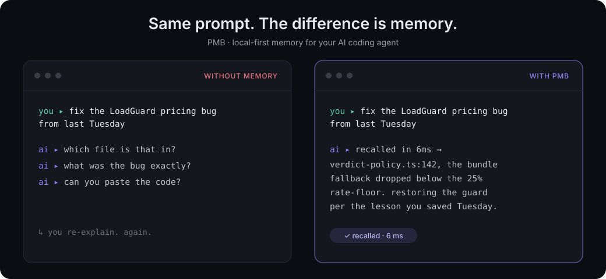
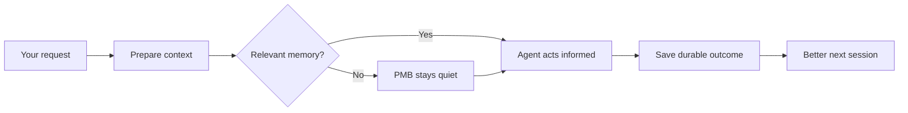

---
hide:
  - navigation
  - toc
---

<div class="hero" markdown>
<div class="hero__eyebrow">Memory that survives the session</div>

# Stop re-explaining your project to your AI

PMB gives Claude Code, Codex, Cursor, and other MCP agents a shared private
memory. It remembers project decisions, lessons, goals, and past work, then
injects the relevant context before the next answer.

SQLite is the durable source of truth. Rebuildable search indexes stay local.
No cloud account, API key, telemetry, or LLM call on the read path.

<div class="hero__actions" markdown>
[View PMB on GitHub](https://github.com/oleksiijko/pmb){ .md-button .md-button--primary }
[Install in 60 seconds](guide/getting-started.md){ .md-button }
</div>
</div>

<div class="hero__metrics" markdown>
<div class="hero__metric" markdown>
<strong>4-16 ms</strong>
<span>Warm prepare call with project context, lessons, and goals.</span>
</div>
<div class="hero__metric" markdown>
<strong>Zero cloud accounts</strong>
<span>Your memory and search indexes remain on your machine.</span>
</div>
<div class="hero__metric" markdown>
<strong>10 core tools</strong>
<span>A small default MCP surface instead of dozens of competing choices.</span>
</div>
<div class="hero__metric" markdown>
<strong>Measured impact</strong>
<span>PMB reports when the evidence is useful, harmful, or insufficient.</span>
</div>
</div>

## Same prompt. The difference is memory.

<div class="pmb-demo" markdown>



</div>

Without memory, the next session starts with clarifying questions. With PMB, the
agent can recover the relevant file, decision, and rule before it starts acting.

## Install once, then keep working

```bash
pip install pmb-ai
pmb setup
pmb warmup
```

Restart your agent and talk normally. PMB handles the memory loop in the
background. Prefer npm? `npx pmb-ai setup` runs the same setup flow.

[Open the setup guide](guide/getting-started.md){ .md-button .md-button--primary }
[Browse the source](https://github.com/oleksiijko/pmb){ .md-button }

## Why PMB feels different

<div class="pmb-feature-grid" markdown>
<div markdown>
<strong>Memory shows up before the model thinks</strong>
<span>Hooks and the `prepare` tool surface relevant context at the start of the task, instead of waiting for the agent to remember to search.</span>
</div>
<div markdown>
<strong>One memory across agents</strong>
<span>Claude Code, Codex, Cursor, Windsurf, Zed, VS Code, and other MCP clients can share the same workspace.</span>
</div>
<div markdown>
<strong>It measures whether lessons help</strong>
<span>Earned Memory joins surfaced lessons to test, build, deploy, and red-to-green outcomes, with conservative confidence checks.</span>
</div>
<div markdown>
<strong>You own every byte</strong>
<span>SQLite is the source of truth, exports are open, deletion is explicit, and optional network features stay opt-in.</span>
</div>
</div>

## The loop



## Evidence, with the caveats visible

| Signal | Current measured result |
|---|---:|
| Warm recall p50 / p95 | **35 ms / 110 ms** |
| Warm `prepare(message)` | **4-16 ms** |
| LoCoMo recall@10 | **94.5%** |
| Multilingual stress top-10 | **99.2%** |

Retrieval quality and real-world outcome impact are different questions. PMB
reports them separately and says `insufficient` when the outcome sample is too
small to support a conclusion.

[Read the measurement methodology](concepts/measuring-impact.md){ .md-button }
[Inspect the benchmarks](https://github.com/oleksiijko/pmb/tree/main/scripts/benchmarks){ .md-button }

## Ready to give your agent a memory?

PMB is Apache-2.0 licensed and runs on Linux, macOS, and Windows.

[View PMB on GitHub](https://github.com/oleksiijko/pmb){ .md-button .md-button--primary }
[Read the documentation](guide/index.md){ .md-button }
