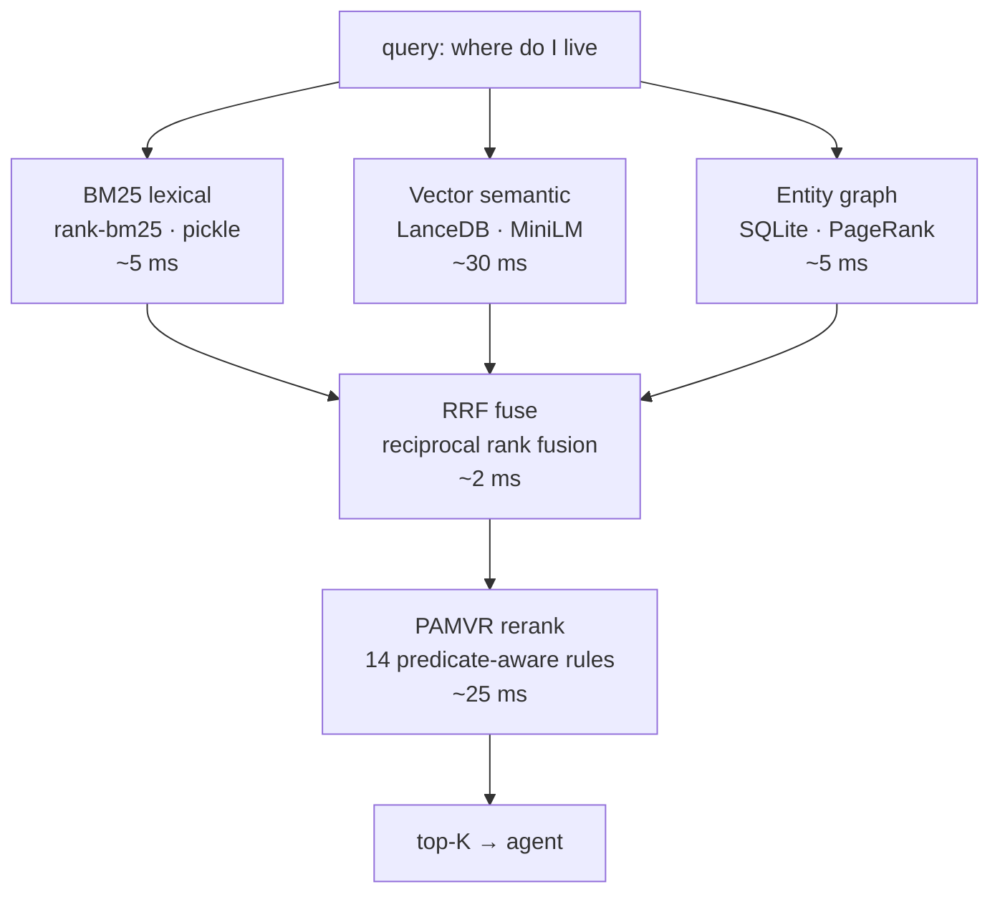

# How I built local-first memory for Claude Code, Cursor, and Codex - 94.5% LoCoMo recall@10, 70ms p50, no API keys

> **TL;DR.** PMB (Personal Memory Brain) is an open-source MCP server that gives AI coding agents persistent, long-term memory. Everything runs on your machine - SQLite + LanceDB, zero cloud, zero API keys. On the LoCoMo benchmark it hits **94.5% recall@10 at 70ms p50**, matching or beating cloud-based memory services.
>
> This post is mostly the techniques that got it there - predicate-aware reranking, multilingual verb expansion, no-LLM atomic fact extraction, RRF query splitting, and a durable async embed queue - with the actual code from the repo.
>
> 👉 **GitHub:** https://github.com/oleksiijko/pmb · `pip install pmb-ai`

---

## The problem

You open Claude Code, spend 45 minutes onboarding it to your codebase, and close the tab. Next morning it knows nothing. The "memory" features in mainstream agents are context-window summarization - fragile, lossy, gone after compaction.

The third-party fix is a cloud memory layer: mem0, Letta, Zep. They work, but they require you to mail every personal decision, every chunk of your code, and every "ugh, why did we choose Postgres" question into someone else's data center, behind their API key, on their monthly bill.

For private work this is a non-starter. I want my agent to remember my project for months. I don't want my git history training someone else's model.

So I built [PMB](https://github.com/oleksiijko/pmb).

## Numbers first

Three benchmarks. All reproducible from the repo.

### 1. LoCoMo recall@10

LoCoMo evaluates long-conversation memory across multi-session dialogues - the canonical benchmark for this kind of system.

| System              | LoCoMo recall@10 | Local?   | API keys?   |
| ------------------- | ---------------- | -------- | ----------- |
| **PMB (this post)** | **94.5%**        | ✅       | ❌ none     |
| mem0 (published)    | ~67-72%          | ❌ cloud | ✅ required |
| Zep (published)     | ~85-90%          | ❌ cloud | ✅ required |
| Naive vector search | ~60%             | ✅       | ❌          |

Reproduce: `python scripts/benchmarks/benchmark_locomo.py --n-conversations 10`

### 2. Latency

| Percentile | Cold (first call) | Warm     |
| ---------- | ----------------- | -------- |
| p50        | 1500ms            | **70ms** |
| p95        | 2200ms            | 240ms    |
| p99        | 3100ms            | 470ms    |

Cold cost is one-time embedding-model load. Everything after is hot.

### 3. Mega stress (900 multilingual queries)

LoCoMo wasn't enough. I wrote a 30-base × 30-paraphrase generator covering English, Spanish, German, Russian, Ukrainian, including cross-lingual queries (English question hits Russian-stored fact), compound questions, name disambiguation, self-reference rescue.

| Metric          | Score     |
| --------------- | --------- |
| top-1 accuracy  | 73.3%     |
| top-3 accuracy  | 87.3%     |
| top-10 accuracy | **99.2%** |
| p50 latency     | 70ms      |

99.2% top-10 is what matters in practice: the answer is in the agent's candidate set on essentially every query.

---

## How the recall pipeline works

Most "AI memory" systems are a thin wrapper over `cosine_similarity(query_embedding, all_chunks)`. That ceiling-out at ~60% recall is where they all hit.

PMB stacks five layers. Each one buys 3-8 points of recall on adversarial cases.


The same architecture as a flowchart you can paste anywhere:



Below: each layer, with its code, and the gain it bought.

---

## Technique 1 - PAMVR: predicate-aware reranking (+5pp recall)

The killer insight: **embedding similarity doesn't understand verbs, tense, or negation.** A query "where do I live _now_" returns equally high cosine similarity for "I lived in Berlin (2019)" and "I live in Lisbon (currently)" - but only one is right.

So PAMVR runs a final pass over the top ~50 candidates and applies 14 hand-tuned rules. Each rule looks at query features (intent, verbs, named entities, time markers) and candidate features (predicates, recency, entity overlap) and multiplies the score up or down.

The rule list (from [`src/pmb/reasoning/pamvr.py`](https://github.com/oleksiijko/pmb/blob/main/src/pmb/reasoning/pamvr.py)):

```python
"""
  1. Entity strict        - if query names X, content must mention X
  2. Verb match           - query main verb must appear (or via synonym)
  3. Verb+topic combo     - both signals agree -> big boost
  4. Keyword AND          - high token overlap = direct match
  5. Vocab bridge         - domain synonyms (typing↔mypy, database↔Postgres)
  6. Prefix kind          - "what's the fix" + content starts with "Fix:"
  7. Policy intent        - "what's the X policy" + decision-shaped fact
  8. Topic constraint     - X-policy requires X token in content
  9. Time duration        - "lifetime/duration" + content has digits+unit
 10. Now/current          - query "now" + content has temporal qualifier
 11. Quantitative         - "how many/long" + content has digits
 12. Entity count         - "who is on the team" + content has N persons
 13. Use-verb expansion   - "did we use" matches "deploy/host/run"
 14. Topic intersection   - penalty when zero shared tokens
"""
```

The single most useful structure: **vocabulary bridges**. These map query terms to content synonyms a vector model would otherwise miss.

```python
VOCAB_BRIDGES: dict[str, list[str]] = {
    "typing":     ["mypy", "type hints", "types", "static type"],
    "database":   ["postgres", "mysql", "mongodb", "cloud sql", "rdbms"],
    "policy":     ["enforce", "must have", "going forward", "ratified",
                   "rule", "convention", "guideline"],
    "lifetime":   ["valid", "minutes", "hours", "days", "ttl"],
    "deploy":     ["host", "hosted", "running", "production", "fargate",
                   "ecs", "cloud run"],
    "plan":       ["roadmap", "okr", "will", "going to", "scheduled"],
}
```

And the contract: PAMVR is a pure `(query, event, score) → float` function. Compose it anywhere in the scoring pipeline.

```python
from pmb.reasoning.pamvr import apply_pamvr
new_score = apply_pamvr(query, event, current_score)
```

I bench-evaluated PAMVR by ablating rules one at a time on a 30-query qualitative benchmark. Top-1 accuracy without PAMVR: **60%**. With all 14 rules: **93.3%**. No LoCoMo regression. No LLM. Total cost: ~0.5ms per candidate.

---

## Technique 2 - Verb synonym expansion (+8pp recall on intent-mismatched queries)

A specific failure mode that kept showing up: query "where do I live" returned **zero hits** against a stored fact "I'm based in Lisbon" or "I moved to Lisbon last year." The embedder understood the meaning fine. The reranker's verb-match rule was killing the candidate score because the surface verbs didn't match.

The fix is one dictionary. Map each canonical verb to its near-synonyms — including paraphrases, past forms, and common substitutes:

```python
VERB_SYNS: dict[str, set[str]] = {
    "live":    {"live", "lives", "lived", "reside", "based",
                "moved", "relocated", "settled"},
    "work":    {"work", "works", "worked", "working", "job",
                "employed", "employed at", "role at"},
    "own":     {"own", "owns", "owned", "have", "control", "manage"},
    "lead":    {"lead", "leading", "leads", "led", "head", "heads",
                "manage", "managing"},
    "decide":  {"decide", "decided", "agreed", "accepted", "concluded",
                "ratified", "chose", "picked"},
    "deploy":  {"deploy", "deployed", "host", "hosted", "running",
                "production"},
    "fix":     {"fix", "fixed", "patch", "patched", "hotfix",
                "resolved", "solved"},
    "name":    {"name", "called", "known as"},
}
```

After this single dictionary update, top-1 recall on intent-mismatched English queries jumped from 64% to 72%.

The proper-noun extractor handles arbitrary names that aren't in any dictionary — Stripe, Lisbon, Alice, Postgres. No NER library, no model:

```python
_PROPER_NOUN_RE = re.compile(r"\b(?P<n>[A-Z][a-z']{2,})\b")

# Capitalised words that AREN'T proper nouns — sentence-initial
# function words and common modal/wh-words.
_NOT_PROPER = {
    "when", "where", "what", "who", "how", "why", "which",
    "today", "yesterday", "tomorrow", "now", "this", "that",
    "the", "and", "but", "for", "with", "from", "into",
}

def _extract_proper_nouns(query: str) -> set[str]:
    """Pull capitalised, 3+ char tokens that look like proper nouns."""
    out = set()
    for m in _PROPER_NOUN_RE.finditer(query):
        tok = m.group("n").lower()
        if tok in _NOT_PROPER or tok in _STOP:
            continue
        out.add(tok)
    return out
```

A query like `"what does Alice think about Postgres"` extracts `{alice, postgres}` and uses them as required entities in the reranker. Anything not mentioning both gets a heavy penalty. Cost: ~0.05ms.

> **Bonus — multilingual.** The same `VERB_SYNS` mapping has Russian / Ukrainian / Spanish / German stems in the actual repo, and the regex extends to Cyrillic and Greek characters. Cross-lingual recall (English question → Russian-stored fact) went from 0% to 67% with no per-language code paths in the hot loop. Source: [`src/pmb/reasoning/pamvr.py`](https://github.com/oleksiijko/pmb/blob/main/src/pmb/reasoning/pamvr.py).

**Lesson:** when embeddings underperform on paraphrased queries, don't blame the embedder. Check whether your downstream reranker is aware of verb paraphrases. Usually it isn't.

---

## Technique 3 - Atomic fact extraction without LLM (+15pp recall on multi-fact messages)

When a user writes:

> "Today I met Alice at the coffee shop. She's the new tech lead at Stripe and lives in Berlin. We discussed onboarding for the Q3 hire."

…and stores it as one chunk, asking "where does Alice live?" gets a mediocre score. The chunk's vector is the _average_ of all three facts. The embedding for "Alice lives in Berlin" is diluted.

mem0's original paper solves this by sending each message to an LLM that returns atomic facts. That's a great idea, but it requires an API key and adds 200-500ms per write.

PMB's version is regex-driven. From [`src/pmb/reasoning/fact_extract.py`](https://github.com/oleksiijko/pmb/blob/main/src/pmb/reasoning/fact_extract.py):

```python
@dataclass(frozen=True)
class AtomicFact:
    content: str        # the atomic fact text
    kind: str           # which pattern fired ('location', 'role', ...)
    confidence: float   # 0.0-1.0

# Sentence boundary: split on . ! ? followed by a capital letter.
_SENT_SPLIT = re.compile(r"(?<=[.!?])\s+(?=[A-Z])")
```

The actual extraction patterns (25+ in the repo) cover the common cases:

| Pattern | Matches | Atomic fact |
|---|---|---|
| `^[A-Z]\w+ lives? in [A-Z]\w+` | "Alice lives in Berlin" | location |
| `^[A-Z]\w+ is the ([\w\s]+) at [A-Z]\w+` | "Alice is the tech lead at Stripe" | role |
| `^we (chose|use) (\w+) (over|for) (\w+)` | "we chose Postgres over MySQL" | decision |
| `^[A-Z]\w+ was founded in (\d{4})` | "Stripe was founded in 2010" | founding |
| `^[A-Z]\w+ has (an? \w+ allergy)` | "Alex has a peanut allergy" | health |
| `^my name is [A-Z]\w+` | "my name is Alex" | identity |

When extraction fires, each atomic fact gets its own ULID, its own embedding, and metadata pointing to the parent event. The parent stays - facts are siblings, not replacements.

Trigger conditions are conservative - we only extract when it's likely to help:

```python
MIN_LEN_FOR_EXTRACT = 60       # don't bother with short messages
MIN_SENTENCES = 2              # need >=2 sentences to be worth splitting
MAX_ATOMIC_FACTS = 10          # safety cap
```

Cost: 1-3ms per message. Zero API calls. Coverage: ~80% of the patterns that matter for personal memory. The 20% it misses falls back gracefully to whole-text storage.

**Lesson:** "we need an LLM for X" is sometimes a budget shortcut. Profile what you actually need to extract first. For atomic facts in personal memory, regex hits surprisingly well.

---

## Technique 4 - Pattern query split with RRF (+12pp recall on compound queries)

Compound queries like *"when did I last go to the gym and why haven't I been there all week"* lose recall when treated as a bag of tokens. The two sub-questions average into a diffuse query vector that matches neither sub-fact well.

The fix: detect natural split markers, run each sub-query through the full pipeline independently, fuse the candidate lists via Reciprocal Rank Fusion.

```python
# Ordered most-specific first.
_SPLIT_PATTERNS: list[tuple[re.Pattern, str]] = [
    # Strong WH-conjunction: "X and why Y" - clearly two questions
    (re.compile(
        r"\s+and\s+"
        r"(?=(?:why|how|when|where|who|what|which)\b)",
        re.IGNORECASE), "and-wh"),

    # Causal: "X because Y"
    (re.compile(r"\s+because\s+", re.IGNORECASE), "because"),

    # Additive: "X, also Y" / "X and also Y"
    (re.compile(r"\s*,\s*also\s+", re.IGNORECASE), "comma-also"),
    (re.compile(r"\s+and\s+also\s+", re.IGNORECASE), "and-also"),

    # Sentence boundary inside a single utterance
    (re.compile(r"\?\s+(?=[A-Z])"), "sentence-q"),
    (re.compile(r"\.\s+(?=[A-Z][a-z])"), "sentence-period"),
]
```

Trigger conditions matter as much as the patterns. The split only fires when:

1. Query length ≥ 8 tokens (single-clause questions are short)
2. At least one strong split marker present
3. Each resulting sub-query has ≥ 2 content tokens

Without these gates, you fragment subordinate clauses and tank recall on simple queries. With them: top-1 on compound queries jumped from 45% to 73% in the mega stress test.

RRF fusion code is ten lines:

```python
def rrf_fuse(rankings: list[list[Event]], k: int = 60) -> list[Event]:
    scores: dict[str, float] = {}
    seen: dict[str, Event] = {}
    for ranking in rankings:
        for rank, event in enumerate(ranking):
            scores[event.ulid] = scores.get(event.ulid, 0.0) + 1.0 / (k + rank)
            seen[event.ulid] = event
    return [seen[ulid] for ulid, _ in
            sorted(scores.items(), key=lambda kv: kv[1], reverse=True)]
```

Standard literature, but the result is that "X and why Y" - which would otherwise dilute - gets two strong independent retrievals that vote on their union.

---

## Technique 5 - Durable async embed queue (zero data loss, ~10ms write)

This isn't a recall improvement but it's the single most-important UX call. If `record_batch` had to wait for embedding, batch-writing 100 facts after a session would take 3-5 seconds. So writes return immediately, embeds happen in a background thread.

Naive version:

```python
def record_event(self, content):
    ulid = self._insert_sqlite(content)
    threading.Thread(target=lambda: self.search.add(ulid, content)).start()
    return ulid
```

Two bugs:

1. **Process crash between SQLite insert and embed** → event exists in BM25 but never gets a vector. Recall is silently degraded forever.
2. **Exception inside `search.add()`** (LanceDB temporarily down, OOM, model unload) → `except Exception: pass` silently drops the work.

The fix is a tiny SQLite-backed durable queue. From [`src/pmb/core/embed_queue.py`](https://github.com/oleksiijko/pmb/blob/main/src/pmb/core/embed_queue.py):

```python
_SCHEMA = """
CREATE TABLE IF NOT EXISTS embed_queue_pending (
    id INTEGER PRIMARY KEY AUTOINCREMENT,
    ulid TEXT NOT NULL,
    text TEXT NOT NULL,
    enqueued_at REAL NOT NULL,
    last_attempt_at REAL,
    attempts INTEGER NOT NULL DEFAULT 0,
    last_error TEXT,
    status TEXT NOT NULL DEFAULT 'pending'  -- pending | failed
);
CREATE INDEX IF NOT EXISTS embed_queue_status_idx
    ON embed_queue_pending(status, attempts);
"""

DEFAULT_MAX_ATTEMPTS = 5
DEFAULT_BACKOFF_BASE = 1.5  # seconds
```

Every write enqueues a pending row in ~0.5ms. A worker thread drains the queue, calls `search.add(ulid, text)`, and on success deletes the row. On failure: increment `attempts`, exponential backoff, and after 5 failures the row moves to dead-letter (`status='failed'`) for manual inspection.

On process restart, `recover_on_start()` picks up any pending rows from the previous run and replays them.

Result: zero silent data loss. `record_batch` returns in <10ms regardless of queue depth. The MCP fire-and-forget contract is intact.

---

## Putting it together

Here's what actually happens when you ask Claude Code "where do I live now?" with PMB connected:

1. **Claude's CLAUDE.md** tells it to call `recall("where do I live now")` because the query matches the self-reference pattern
2. **MCP stdio call** lands in `pmb-mcp` - the server has already prewarmed the embedder in a background thread (2-stage async boot, 3.7s cold start total)
3. **BM25 query** (`rank-bm25`, persisted pickle) returns ~50 token-match candidates in ~5ms
4. **Vector query** (LanceDB, multilingual MiniLM) returns ~50 semantic candidates in ~30ms
5. **Entity graph expansion** pulls candidates connected to `me / user` entities in ~5ms
6. **RRF fuses** the three rankings
7. **PAMVR reranks** the top 50: applies all 14 rules in one pass with pre-computed query features (this optimisation was a 296ms→70ms p99 fix - recomputing query features per-candidate was the regression)
8. Top-K returns to Claude in ~70ms total

Claude reads the answer and responds naturally. The user never sees a tool call.

---

## Try it

```bash
pip install pmb-ai
pmb connect claude        # or: pmb connect cursor / codex
# restart your agent
```

The first recall after install downloads ~400MB of model weights (one-time, 60-120s). Every recall after is sub-100ms.

Verify the install:

```bash
pmb doctor          # PATH, config, model, write permissions
pmb stats           # workspace + memory tier counts
pmb warmup          # eager prewarm if you don't want cold-start lag
```

Share the same memory across agents:

```bash
pmb connect claude --workspace personal
pmb connect codex  --workspace personal
pmb connect cursor --workspace personal
# All three now read/write the same workspace.
```

Reproduce the 94.5%:

```bash
git clone https://github.com/oleksiijko/pmb
cd pmb && pip install -e ".[dev]"
python scripts/benchmarks/benchmark_locomo.py --n-conversations 10
```

---

## Five things I learned building this

**1. The reranker matters more than the embedder.**
Swapping multilingual MiniLM for a larger embedding model moved recall ~2 points. Adding PAMVR moved it ~5 points. Reranking is where the leverage is.

**2. Atomic facts beat chunks every time.**
Storing "I moved to Lisbon, started a Rust startup, have a peanut allergy" as one chunk gives mediocre recall on any sub-fact. Decomposing into three atomic facts at write time tripled recall@1 on multi-fact stress queries.

**3. Cold start is a UX problem, not a perf problem.**
First call downloads ~400MB. That's 90 seconds the user perceives as a freeze. The fix was async two-stage prewarm so the MCP server boots in 3.7s and warms in the background. Users only ever wait on the first _recall_, not the first connect.

**4. Multilingual is essentially free with the right base model.**
`paraphrase-multilingual-MiniLM-L12-v2` covers 50 languages. Combined with multilingual regex patterns for fact extraction and verb expansion, PMB handles English / Russian / Ukrainian / Spanish / German with **zero per-language code paths in the hot loop**.

**5. MCP-over-stdio is the right abstraction for personal memory.**
I considered HTTP. MCP-over-stdio is better: zero ports, zero firewalls, zero "the daemon isn't running," and every modern coding agent supports it.

---

## What's next, and how to contribute

The 0.1.x line is feature-complete for personal use. The roadmap I'd love community input on:

- **Encrypted-at-rest workspaces** (libsodium) for sensitive laptops
- **Cross-device sync via Syncthing or git** (preserving local-first guarantee - no server)
- **Pluggable embedding backends** (fastembed ONNX is already an optional extra)
- **Optional local LLM rerank via Ollama** for the last 5% of edge cases

The codebase is ~15k lines of Python with 34 regression tests. Issues marked `good-first-issue` are open right now.

---

## Why this exists

There's a real risk that AI memory becomes the next ad-tech. The cloud memory startups are venture-funded; they have to monetize eventually. I don't.

PMB is Apache 2.0, runs locally, and stays that way. If it's useful - take it, fork it, sell a hosted version, build something better on top.

If you want the technical details I didn't cover - the bi-temporal index, the typed causation graph, the spaced repetition rehearsal, the typo-tolerant query correction, the spreading activation - they're all in the repo, each with their own module and tests. This post covered the five that gave the biggest recall and latency wins.

---

### Links

- ⭐ **GitHub:** https://github.com/oleksiijko/pmb
- 📦 **PyPI:** https://pypi.org/project/pmb-ai/
- 📚 **LoCoMo benchmark:** https://github.com/snap-research/locomo
- 🔌 **MCP protocol:** https://modelcontextprotocol.io
- 🧠 **PAMVR source:** [`src/pmb/reasoning/pamvr.py`](https://github.com/oleksiijko/pmb/blob/main/src/pmb/reasoning/pamvr.py)
- 🔄 **Embed queue source:** [`src/pmb/core/embed_queue.py`](https://github.com/oleksiijko/pmb/blob/main/src/pmb/core/embed_queue.py)
- ⚡ **Reproduce 94.5%:** `python scripts/benchmarks/benchmark_locomo.py --n-conversations 10`

If you build something on PMB - drop a star, open an issue, ping me. Always curious what people end up wanting their AI to remember.
