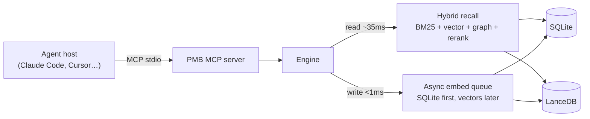

## The big picture

- **Storage** - every event in SQLite; vectors in LanceDB beside it. Both are
  files on disk; copy them anywhere with `cp`.
- **Recall** - BM25 (lexical) + dense vector + entity graph, fused with
  Reciprocal-Rank-Fusion plus an optional cross-encoder rerank.
- **Writes** - async; the MCP tool returns sub-ms, embedding happens on a
  background thread.

## One warm daemon, many clients

Rather than each agent loading its own model and vector store, PMB runs **one
warm daemon** (Engine + model + LanceDB) that N clients share for instant recall.

| Mode | Transport | What runs |
| --- | --- | --- |
| Local (default) | daemon + HTTP, stdio proxy where needed | One warm runtime; Claude Code/Cursor point at the daemon, Codex via `pmb mcp proxy`. |
| Local stdio | stdio | One per-client process - compatible, but more cold-start cost. |
| Team / multi-machine | streamable HTTP + bearer token | One shared server for remote agents (behind a private network). |

## Two surfaces, one engine

PMB reaches the agent two ways, and they're complementary:

<CardGroup cols={2}>
  <Card title="MCP tools" icon="plug">
    The deliberate ceiling - `prepare`, `recall`, `record_batch`… the agent calls
    these on purpose.
  </Card>
  <Card title="Lifecycle hooks" icon="wand-magic-sparkles">
    The involuntary floor - auto-recall, ambient write, session restore,
    follow-through. Memory works without the model remembering to call a tool.
  </Card>
</CardGroup>

<Note>
  On hook-enabled hosts (Claude Code, Codex), MCP and hooks are kept **together**
  - they're complementary, not redundant. See
  [How it works](/concepts/how-it-works) and [Core engine](/concepts/core-engine).
</Note>
