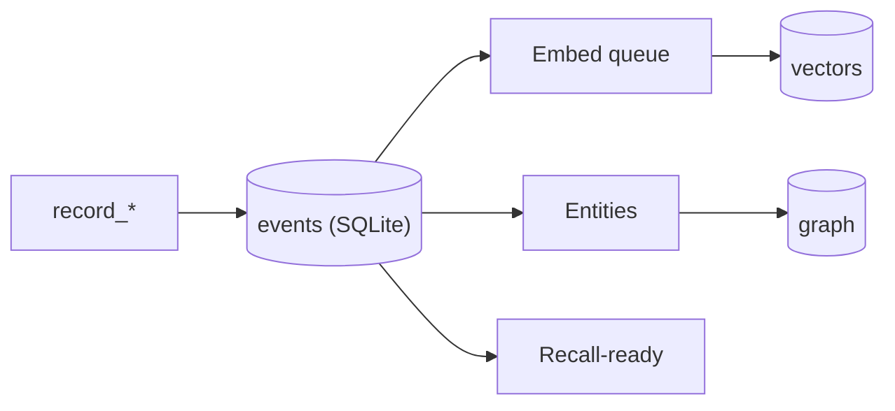
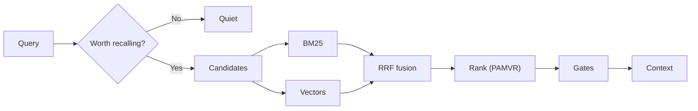

## What the Engine owns

`src/pmb/core/engine/base.py` builds one `Engine` per workspace, composed from
focused mixins. The constructor opens SQLite immediately but keeps BM25, LanceDB,
embedding models, and graph caches lazy - so `pmb stats` and `pmb config` don't
pay the vector-store cold start.

<CardGroup cols={2}>
  <Card title="Config" icon="gear">
    Workspace detection, layered settings, model choice, and feature gates.
  </Card>
  <Card title="Stores" icon="database">
    SQLite for truth, LanceDB for vectors, BM25 for exact terms, graph tables for links.
  </Card>
  <Card title="Runtime" icon="bolt">
    Session tracker, recall cache, write outbox, embed queue, touch buffer.
  </Card>
  <Card title="Surfaces" icon="layer-group">
    Write, batch, recall, lessons, overview, goals, dedup, health, ambient APIs.
  </Card>
</CardGroup>

## Storage schema

SQLite is the source of truth (`events.sqlite`); LanceDB is the vector side index
beside it.

| Store | Table / file | Purpose |
| --- | --- | --- |
| SQLite | `events` | Main log: ULID, type, content, metadata, importance, access counts, tier. |
| SQLite | `event_edges` | Event-to-event reasoning edges (cause/support/conflict/derived). |
| SQLite | `lesson_surfaces` | Which lessons were shown and whether they were followed. |
| SQLite | `write_outbox` | Durable queue for async `record_batch` writes (replayable). |
| SQLite | `embed_queue_pending` | Durable embedding queue with retry + dead-letter. |
| SQLite | `error_log` | Swallowed background errors, surfaced by `pmb doctor`. |
| SQLite | `graph_entities` / `graph_edges` | Canonical entities + weighted co-mention edges. |
| LanceDB | `events` | Vector rows: `ulid`, `vector`, `text`. |
| Cache | `bm25_index.pkl` | Cached BM25 token index, rebuilt when stale. |

## Write path

Writes are **durable first**: the event lands in SQLite before any optional
background work. Embeddings, graph extraction, and dedup may lag - they have
retry paths and safe fallbacks - and recall can still find a fresh event via
SQLite + BM25 while the embedder warms.

## Recall path

The hot path never calls an LLM. Optional LLM work happens at write time,
maintenance time, or for explicit commands (`consolidate`, `reflect`, `distill`).

## Concurrency & durability

<CardGroup cols={2}>
  <Card title="SQLite WAL + busy-timeout" icon="lock">
    Dashboard, MCP, hooks, and CLI can touch one workspace at once.
  </Card>
  <Card title="Single warm runtime" icon="fire">
    The daemon keeps one warm Engine/model/vector store instead of loading per agent.
  </Card>
  <Card title="Crash-safe queues" icon="rotate">
    Async writes and pending embeddings have durable tables that replay after restart.
  </Card>
  <Card title="Buffered touches" icon="layer-group">
    Recall access-count updates are coalesced so parallel recalls don't fight SQLite.
  </Card>
</CardGroup>

## Code map

| Concern | Source |
| --- | --- |
| Engine composition | `src/pmb/core/engine/base.py` |
| Write / recall / lessons / goals | `src/pmb/core/engine/` |
| Event schema + lifecycle | `src/pmb/core/events.py` |
| BM25 / LanceDB backends | `src/pmb/core/search.py` |
| Entity graph | `src/pmb/graph/store.py` |
| MCP tools + server | `src/pmb/mcp/` |
