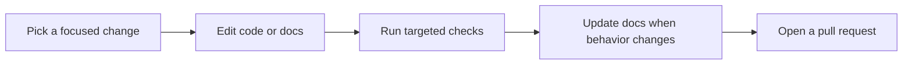

## Setup

```bash
git clone https://github.com/oleksiijko/pmb.git && cd pmb
python -m venv .venv && source .venv/bin/activate
pip install -e ".[dev]"
pytest                  # full suite (~4 min)
pytest -k recall        # fast subset (~12s)
```

<Note>
  Use the venv's Python, not system Python - `.venv/bin/python -m pytest` (or
  `.venv\Scripts\python.exe -m pytest` on Windows). Bare `pytest` outside the
  venv just reports missing deps.
</Note>

## What good looks like

<CardGroup cols={2}>
  <Card title="Small & focused" icon="scissors">
    One concern per PR. Open a discussion before a large change so we can align.
  </Card>
  <Card title="Docs alongside code" icon="book">
    When behaviour changes, update the CHANGELOG, the command/config reference,
    and the relevant guide.
  </Card>
  <Card title="Tests pass" icon="circle-check">
    Lint (ruff) is blocking; the suite runs on Linux/macOS/Windows × Py 3.11-3.13.
  </Card>
  <Card title="Adding a language" icon="language" href="/contributing/adding-a-language">
    Usually nothing to do - the embedder already knows it.
  </Card>
</CardGroup>

License: **Apache-2.0**. Issues and PRs welcome.
